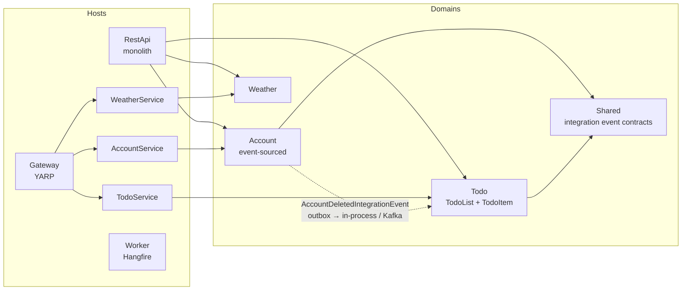

# CleanDDDArchitecture

[](https://github.com/panosru/CleanDDDArchitecture/actions/workflows/dotnetcore.yml)
[](https://github.com/panosru/CleanDDDArchitecture/actions/workflows/codeql-analysis.yml)
[](LICENSE)

A reference application for **Domain-Driven Design, CQRS and Event Sourcing on .NET 10**, built on the [Aviant](https://github.com/tecfinity/Aviant) library. The same domain code runs as **one monolith or as separate microservices**, switched with a flag.

## What it shows

- **Bounded contexts that stay independent.** Account, Todo and Weather never reference each other. When an account is deleted, Todo removes that user's lists by consuming an `AccountDeletedIntegrationEvent`, written to a **transactional outbox** and delivered in-process (monolith) or over **Kafka** (microservices).
- **An event-sourced aggregate.** `AccountAggregate` is rebuilt from its events in EventStoreDB; the events are also published to Kafka.
- **A rich domain model.** Aggregates and entities change only through behaviour (`Rename`, `Complete`, `ConfirmEmailChange`), guarded by value objects (`EmailAddress`, `PersonName`). A broken rule is a `DomainRuleException`, which the pipeline turns into a 400, not a 500.
- **Architecture enforced by tests.** `Tests/Architecture` fails the build if Core depends on an outer layer, if a domain references another domain, or if an aggregate lives outside Core.
- **Observability from the start.** Every host sends OpenTelemetry traces, metrics and logs; under Aspire they appear in one dashboard.
- **A clean licence story.** Every dependency is free for commercial use, and a package with a known vulnerability fails the build ([ADR 006](docs/adr/006-dependency-licensing.md)).

## Architecture



Every domain has the same layers, and the dependency rules between them are tested:

| Layer | Contains | May depend on |
|---|---|---|
| **Core** | Aggregates, entities, value objects, domain events, repository interfaces | Aviant core, Shared.Core |
| **Application** | Use cases, commands and queries (CQRS), validators, event handlers | Core |
| **Infrastructure** | EF Core contexts, repositories, EventStore, Kafka | Application, Core |
| **CrossCutting** | Dependency registration for the domain | all of the above |
| **Hosts/…/Presentation** | Controllers and minimal API endpoints | Application |

A request goes: **controller or endpoint → use case → orchestrator → MediatR pipeline** (validation, logging, retries) **→ handler → aggregate**. Then either a success, a refusal returned as a failed response, or a fault handled by the single ProblemDetails error handler.

## Getting started

Prerequisites: the [.NET 10 SDK](https://dotnet.microsoft.com/download) and Docker.

```bash
git clone --recurse-submodules https://github.com/panosru/CleanDDDArchitecture.git
cd CleanDDDArchitecture
```

### With .NET Aspire (recommended)

```bash
dotnet run --project Hosts/AppHost                          # monolith: RestApi + Worker
dotnet run --project Hosts/AppHost -- --mode microservices  # Account, Todo, Weather services + Gateway
```

Aspire starts PostgreSQL, Kafka, EventStoreDB and Mailpit, wires every connection string, and opens the dashboard at **http://localhost:15888** with logs, traces, metrics and health for each resource. In monolith mode the API serves Scalar at **https://localhost:8091/scalar/v1**.

### With Docker Compose

```bash
cd docker
cp .env.example .env
docker compose --profile core up -d                                   # PostgreSQL, Redis, Mailpit
docker compose --profile core --profile eventing up -d                # + Kafka (needed by Account)
docker compose --profile core --profile eventing --profile microservices up -d --build
```

Each host also runs on its own: `dotnet run --project Hosts/RestApi/Presentation`.

## Tests

| Kind | Where | Needs |
|---|---|---|
| Architecture rules | `Tests/Architecture` | — |
| Unit | `Domains/*/Tests/Unit`, `Domains/Shared/Tests/Unit` | — |
| Behaviour (in-process HTTP, TestHost) | `Hosts/RestApi/Tests/Behaviour`, `Domains/Weather/Tests/Behaviour` | — |
| Todo queries on EF Core in-memory | `Domains/Todo/Tests/Integration` | — |
| End-to-end: services, gateway, Kafka, EventStore, PostgreSQL | `Domains/Account/Tests/Integration` | Docker |

```bash
dotnet test CleanDDDArchitecture.sln     # everything
./scripts/test-and-coverage.sh           # with coverage, as CI runs it
```

The end-to-end tests start real containers with Testcontainers, build and launch the services, and drive them through the gateway: sign-up, email confirmation, login, MFA, email change, todos, and account deletion reaching the Todo service.

## Technology

| Concern | Choice |
|---|---|
| Framework | .NET 10, ASP.NET Core |
| DDD / CQRS / Event Sourcing | [Aviant](https://github.com/tecfinity/Aviant), MediatR 12.5 (Apache-2.0, pinned) |
| Persistence | EF Core 10 + PostgreSQL; EventStoreDB for event-sourced aggregates |
| Messaging | Kafka (Confluent.Kafka), transactional outbox |
| Validation | FluentValidation |
| API | Controllers and minimal APIs, Asp.Versioning, Microsoft.AspNetCore.OpenApi + Scalar, RFC 9457 problem details |
| Auth | ASP.NET Core Identity, JWT bearer, TOTP MFA, refresh sessions |
| Background jobs | Hangfire on PostgreSQL |
| Observability | OpenTelemetry (OTLP), Serilog |
| Local orchestration | .NET Aspire 13 |
| Web UI | ASP.NET Core Razor Pages (`Hosts/WebApp`) |
| Testing | xUnit v3, AwesomeAssertions, Testcontainers, NetArchTest |

Mapping is explicit (a `From(entity)` factory or an EF Core projection expression on each DTO). There is no runtime mapper.

## Design decisions

Recorded as ADRs in [docs/adr](docs/adr):

1. [Event Sourcing for the Account domain](docs/adr/001-event-sourcing-account-domain.md)
2. [Kafka for eventing](docs/adr/002-kafka-for-eventing.md)
3. [Vertical slice architecture](docs/adr/003-vertical-slice-architecture.md)
4. [OpenAPI + Scalar over Swashbuckle](docs/adr/004-openapi-scalar-over-swashbuckle.md)
5. [.NET Aspire AppHost](docs/adr/005-aspire-apphost.md)
6. [Dependency licensing](docs/adr/006-dependency-licensing.md)
7. [Controllers and minimal APIs](docs/adr/007-controllers-and-minimal-apis.md)

## Contributing

Contributions are welcome. Read [CONTRIBUTING.md](CONTRIBUTING.md), and report security issues privately as described in [SECURITY.md](SECURITY.md). Changes are recorded in [CHANGELOG.md](CHANGELOG.md).

## Credits

This repository began from Jason Taylor's [Clean Architecture template](https://github.com/jasontaylordev/CleanArchitecture) and has since been rebuilt around DDD, event sourcing and Aviant. The early history keeps his commits and those of the template's contributors.

## License

MIT. See [LICENSE](LICENSE).
